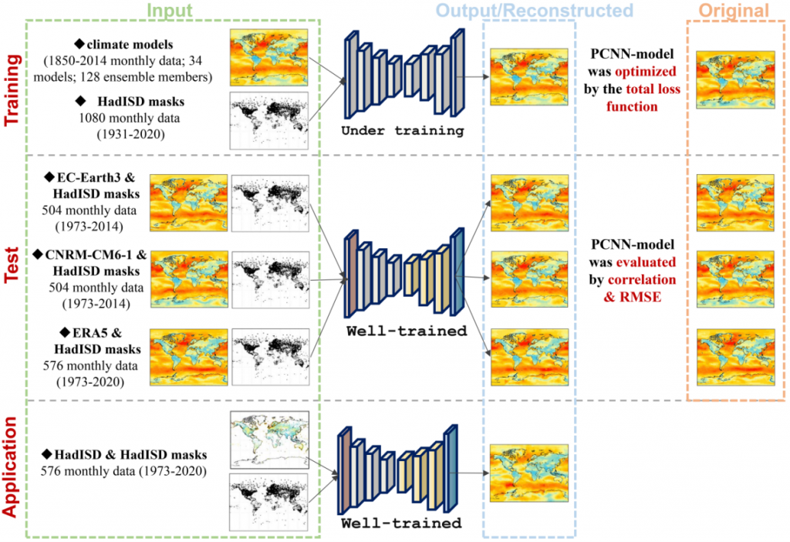

# PCNN for wind reconstruction

**[Applied implementation] (https://github.com/naoto0804/pytorch-inpainting-with-partial-conv)**

This project is a PCNN-based method for wind reconstruction.



## Requirements
- Python 3.6+
- Pytorch 1.0+

```
pip install torch==1.9.0+cu102 torchvision==0.10.0+cu102 torchaudio==0.9.0
pip install tensorboardX==2.4
pip install -r requirements.txt
```

## Usage

### Data preparation
- To get your training data and evaluation data, use util/split_data_for_144.py to split the data and mask for obtaining training data and evaluation data, in which you should prepare the win speed data and the mask of reconstruction dataset.
- Because every wind map should has its own mask, so the size of train_data.h5 and train_mask.h5 should have the same shape.
- Put the data in the fold in ./datasets/win_speed, including train_data.h5, train_mask.h5,  eval_data.h5, eval_mask.h5, test_data.h5, test_mask.h5
- Use util/data_analyze.py to get the min value and max value.

### Specify your own dataloader

In pytorch, it often uses to_tensor to transform image (min value is 0, and max value is 255). In our research, we also adopted the similar strategy that we used minmaxscaler to transform the data to [0,1], so you can specify your by revise the MAX and MIN in **opt.py**.

We also used z-score, so you can specify your MEAN and STD in **opt.py.**

For constructing your own dataloader, you should use minmaxscaler and transforms.Normalize(mean=opt.MEAN, std=opt.STD) in your dataloader. And for output, you should use the un-minmax and un-normalization function to get the exact output.

```python
from util.image import UnMinMaxUnNormalization

unminmax_unnormalization = UnMinMaxUnNormalization(device)
output = unminmax_unnormalization(output)
```

### Command to run

#### Train

Train the data on your training and evaluation dataset

```
python train.py --gpu_id 0 --batch_size 64 --model_name train_wind_speed_model_1 --max_iter 200000 --loss_valid 1 --loss_hole 6 --loss_style 20 --loss_prc 0.05 --loss_tv 0.1 --image_size 144 --root dataset/win_speed/144x144 --mask_root dataset/win_speed/144x144
```

#### Test

Test the data on your own dataset

```
python test.py --batch_size 64 --model_name train_wind_speed_model_1 --root dataset/win_speed/144x144/test --phrase test --iter 200000 --save_tensor --data_name test_data.h5 --mask_name test_mask.h5
```

#### Inference 

Inference  the data on your own dataset

```
python test.py --gpu_id 0 --model_name train_wind_speed_model_1 --root dataset/win_speed/144x144/inference --phrase test --iter 200000 --save_tensor --data_name inference_data.h5 --mask_name inference_mask.h5
```

